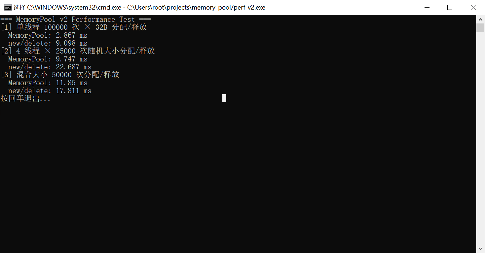

# MemoryPool

基于 C++17 的自研内存池，仿 tcmalloc 三级缓存架构。

---

## 架构

```
allocate(size)
    │
    ▼
┌─────────────────────────────────────────────┐
│ ThreadCache                                  │
│ · thread_local，每个线程独立，无锁            │
│ · 32768 条空闲链表（8B ~ 256KB）             │
│ · 本地命中直接返回，>64 块自动归还           │
└──────────────────┬──────────────────────────┘
                   │ 本地空
    ▼
┌─────────────────────────────────────────────┐
│ CentralCache                                 │
│ · 全局单例，线程间共享                       │
│ · 自旋锁保护，32768 把锁，粒度到单条链表     │
│ · PageCache 取 Span → 切成小块 → 批量发给    │
│   ThreadCache                                │
└──────────────────┬──────────────────────────┘
                   │ 中心空
    ▼
┌─────────────────────────────────────────────┐
│ PageCache                                    │
│ · 全局单例，std::mutex 保护（低频）          │
│ · 直接调 VirtualAlloc 向 OS 申请 4KB 页      │
│ · Span 切分/合并，按页数挂不同链表           │
└──────────────────┬──────────────────────────┘
                   │
    ▼
  Windows VirtualAlloc
```

---

## 项目结构

```text
├── include/
│   ├── Common.h           # 对齐常量 + SizeClass
│   ├── PageCache.h        # 页缓存接口
│   ├── CentralCache.h     # 中心缓存接口
│   ├── ThreadCache.h      # 线程本地缓存接口
│   └── MemoryPool.h       # 对外统一入口
├── src/
│   ├── PageCache.cpp      # Span 分配/切分/合并/回收
│   ├── CentralCache.cpp   # 批量调拨，自旋锁
│   └── ThreadCache.cpp    # 本地分配，归还策略
└── tests/
    ├── UnitTest.cpp       # 基础 + 多线程
    └── PerformanceTest.cpp
```

---

## 编译 & 运行

**性能测试：**

```bash
g++ -O2 -std=c++17 -pthread src/PageCache.cpp src/CentralCache.cpp src/ThreadCache.cpp tests/PerformanceTest.cpp -o perf.exe && ./perf.exe
```

**单元测试：**

```bash
g++ -O2 -std=c++17 -pthread src/PageCache.cpp src/CentralCache.cpp src/ThreadCache.cpp tests/UnitTest.cpp -o test.exe && ./test.exe
```

VS Code：`Ctrl+Shift+B` 编译，`F5` 调试。

---

## Benchmark

| 场景 | MemoryPool | new/delete | 加速比 |
| ---- | ---------: | ---------: | -----: |
| 单线程 100K 次 × 32B | 2.6 ms | 8.9 ms | **3.4x** |
| 4 线程 25K 次随机大小 | 11.4 ms | 21.5 ms | **1.9x** |
| 混合 8 种大小 50K 次 | 16.2 ms | 18.5 ms | **1.1x** |



---

## 环境

- Windows / MinGW-w64 (g++ 8.0+)
- C++17
- 仅依赖标准库 + windows.h
